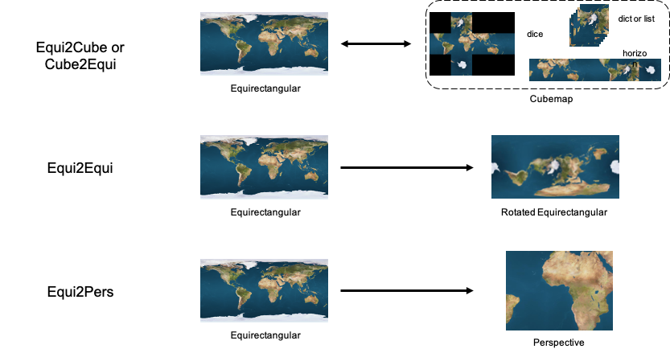

<h1 align="center">
  equilib
</h1>

<h4 align="center">
  Processing Equirectangular Images with Python
</h4>

<div align="center">
  <a href="https://badge.fury.io/py/pyequilib"></a>
  <a href="https://pypi.org/project/pyequilib"></a>
  <a href="https://github.com/haruishi43/equilib/actions"></a>
  <a href="https://github.com/haruishi43/equilib/blob/master/LICENSE"></a>
</div>



- A library for processing equirectangular image that runs on Python.
- Developed using `numpy` and `torch` (`c++` is WIP).
- Able to use GPU for faster processing.
- No need for other dependencies except for `numpy` and `torch`.
- Added functionality like creating rotation matrices, batched processing, and automatic type detection.
- Highly modular

## Installation:

Prerequisites:
- Python (>=3.6)
- Pytorch

```Bash
pip install pyequilib
```

For developing, use:

```Bash
git clone --recursive https://github.com/haruishi43/equilib.git
cd equilib

pip install -r requirements.txt

python setup.py develop
```

## Basic Usage:

`equilib` has different transforms of equirectangular (or cubemap) images (note each transform has `class` and `func` APIs):
- `Cube2Equi`/`cube2equi`: cubemap to equirectangular transform
- `Equi2Cube`/`equi2cube`: equirectangular to cubemap transform
- `Equi2Equi`/`equi2equi`: equirectangular transform
- `Equi2Pers`/`equi2pers`: equirectangular to perspective transform

There are no _real_ differences in `class` or `func` APIs:
- `class` APIs will allow instantiating a class which you can call many times without having to specify configurations (`class` APIs call the `func` API)
- `func` APIs are useful when there are no repetitive calls
- both `class` and `func` APIs are extensible, so you can extend them to your use-cases or create a method that's more optimized (pull requests are welcome btw)

Each API automatically detects the input type (`numpy.ndarray` or `torch.Tensor`), and outputs are the same type.

An example for `Equi2Pers`/`equi2pers`:

<table>
<tr>
<td><pre>Equi2Pers</pre></td>
<td><pre>equi2pers</pre></td>
</tr>

<tr>
<td>
<pre>

```Python
import numpy as np
from PIL import Image
from equilib import Equi2Pers

# Input equirectangular image
equi_img = Image.open("./some_image.jpg")
equi_img = np.asarray(equi_img)
equi_img = np.transpose(equi_img, (2, 0, 1))

# rotations
rot = {
    'roll': 0.,
    'pitch': np.pi/4,  # rotate vertical
    'yaw': np.pi/4,  # rotate horizontal
}

# Intialize equi2pers
equi2pers = Equi2Pers(
    w_pers=640,
    h_pers=480,
    fov_x=90,
    skew=0.0,
    sampling_method="default",
    mode="bilinear",
)

# obtain perspective image
pers_img = equi2pers(
    equi=equi_img,
    rot=rot,
)
```

</pre>
</td>

<td>
<pre>

```Python
import numpy as np
from PIL import Image
from equilib import equi2pers

# Input equirectangular image
equi_img = Image.open("./some_image.jpg")
equi_img = np.asarray(equi_img)
equi_img = np.transpose(equi_img, (2, 0, 1))

# rotations
rot = {
    'roll': 0.,
    'pitch': np.pi/4,  # rotate vertical
    'yaw': np.pi/4,  # rotate horizontal
}

# Run equi2pers
pers_img = equi2pers(
    equi=equi_img,
    rot=rot,
    w_pers=640,
    h_pers=480,
    fov_x=90,
    skew=0.0,
    sampling_method="default",
    mode="bilinear",
)
```

</pre>
</td>
</table>

For more information about how each APIs work, take a look in [.readme](.readme/) or go through example codes in the `tests` or `demo`.
See performance and benchmarking results of the APIs in [.readme/benchmarks.md](.readme/benchmarks.md).


### Coordinate System:

__Right-handed rule XYZ global coordinate system__. `x-axis` faces forward and `z-axis` faces up.
- `roll`: counter-clockwise rotation about the `x-axis`
- `pitch`: counter-clockwise rotation about the `y-axis`
- `yaw`: counter-clockwise rotation about the `z-axis`

See demo scripts under `scripts`.


## Grid Sampling

To process equirectangular images fast, whether to crop perspective images from the equirectangular image, the library takes advantage of grid sampling techniques.
Some sampling techniques are already implemented, such as `scipy.ndimage.map_coordiantes` and `cv2.remap`.
This project's goal was to reduce these dependencies and use `cuda` and batch processing with `torch` and `c++` for a faster processing of equirectangular images.
There were not many projects online for these purposes.
In this library, we implement varieties of methods using `c++`, `numpy`, and `torch`.
This part of the code needs `cuda` acceleration because grid sampling is parallelizable.
For `c++` and `torch`, I tried to take advantage of `cuda`.
For `numpy`, I implemented `naive` and `faster` approaches for learning purposes.
Developing _faster_ `c++` and `torch` approaches are __WIP__.
Currently, `sampling_method` defaults to the fastest methods which are named `"default"`.
See [here](equilib/grid_sample/README.md) for more info on implementations.

## Develop:

Test files for `equilib` are included under `tests`.

Running tests:
```Bash
pytest tests
```

Check [CONTRIBUTING.md](./CONTRIBUTING.md) for more information

### TODO:

- [ ] Documentations for each transform
- [x] Add table and statistics for speed improvements
- [ ] Batch processing for `numpy`
- [ ] Mixed precision for `torch`
- [ ] `c++` version of grid sampling

## Acknowledgements:

- [py360convert](https://github.com/sunset1995/py360convert)
- [Perspective-and-Equirectangular](https://github.com/timy90022/Perspective-and-Equirectangular)
